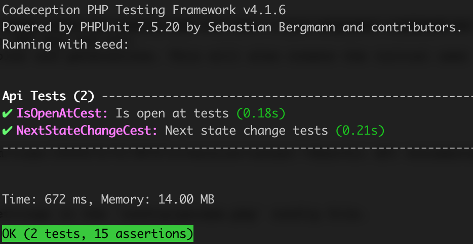

# A Rest API for managing open hours

You can do crud operations on entities, and also add weekly schedule of open hours.
It takes care of exception times (holidays) and overlapping (exceptions and open hours).

## API Documentation

- <a href="https://documenter.getpostman.com/view/1900475/T1LPESo1?version=latest">Restful API Documentation</a>

Main directories
-------------------

      config/             contains application configurations
      controllers/        contains Web controller classes
      models/             contains model classes
      tests/              contains various tests for the basic application


REQUIREMENTS
------------

PHP Version >= 7.1.0.


INSTALLATION
------------

### Install Manually

1. Clone the project
2. Run composer install
3. Once the project creation procedure completed, edit db config and run the `./yii migrate` command to create the required tables.


### Install with Docker

Update your vendor packages

    docker-compose run --rm php composer update --prefer-dist
    
Run the installation triggers (creating cookie validation code)

    docker-compose run --rm php composer install    
    
Start the container

    docker-compose up -d
    
You can then access the application through the following URL:

    http://127.0.0.1:8000

**NOTES:** 
- Minimum required Docker engine version `17.04` for development (see [Performance tuning for volume mounts](https://docs.docker.com/docker-for-mac/osxfs-caching/))


CONFIGURATION
-------------

### Database

Edit the file `config/db.php` with real data, for example:

```php
return [
    'class' => 'yii\db\Connection',
    'dsn' => 'mysql:host=localhost;dbname=openhours',
    'username' => 'root',
    'password' => '1234',
    'charset' => 'utf8',
];
```

**NOTES:**
- Yii won't create the database for you, this has to be done manually before you can access it.
- Refer to the README in the `tests` directory for information specific to basic application tests.


TESTING
-------

Tests are located in `tests` directory. They are developed with [Codeception PHP Testing Framework](http://codeception.com/).

Currently 2 API tests for `is-open-at` and `next-state-chage` endpoints are implemented:

- https://github.com/mmirzaee/opening-hours/blob/master/tests/api/IsOpenAtCest.php
- https://github.com/mmirzaee/opening-hours/blob/master/tests/api/NextStateChangeCest.php

Above tests include different scenarios of precedence and overlapping. Tests can be executed by running:

```
vendor/bin/codecept run
```

Both should pass:



